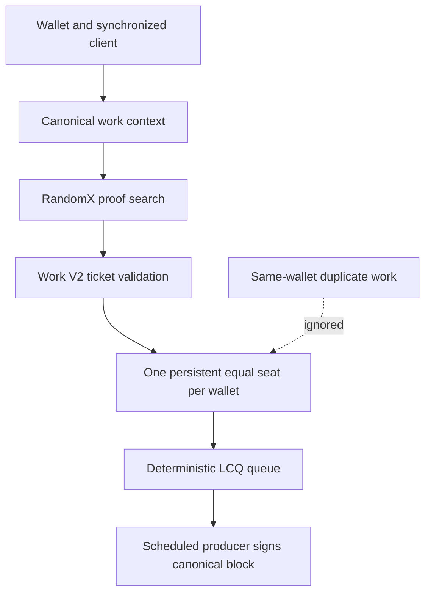
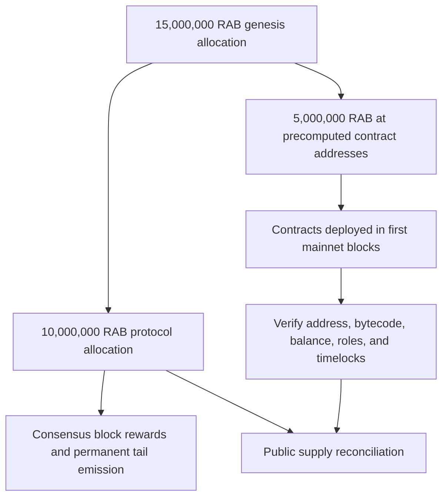

# Rabbit Chain

## Permissionless EVM Layer 1 with Live Consensus Queue

**Technical Whitepaper - Public Testnet V2 Edition v1.2**
**9 September 2026**

> One wallet. One persistent equal consensus seat.

---

## Document status

| Item | Public status |
|---|---|
| Rabbit Testnet V2 | Live |
| Chain ID / Network ID | `9280` / `9280` |
| Native test asset | `tRAB` |
| Consensus | LCQ with permissionless Work V2 admission |
| Execution | EVM / EIP-1559 |
| Release | `rabbit-core-testnet-v2.2.2` |
| Source commit | `249380bdd23582c4a1194b71e9f12f4cdd214472` |
| Required hard-fork block | `50000` |
| Genesis file SHA-256 | `dfbc8992c5d9bce8684428ed43ca98494bb1745571c966915f8fec1a44157839` |
| Canonical block-0 hash | `0x9b71d7f2922fdf8383a4a12be5594e25938625195e0d84c05c3bd71b7bcf93f7` |
| Public RPC | <https://rpc-testnet.rabbitchain.org> |
| Explorer | <https://explorer-testnet.rabbitchain.org> |
| Mainnet | Not live; planned chain ID `928` |

Testnet software and tRAB are experimental. Testnet assets have no promised monetary value. Mainnet parameters, contracts, custody mechanisms and dates are not final unless published through a separate signed release.

## Abstract

Rabbit Chain is a permissionless, EVM-compatible Layer 1 network designed around a simple fairness objective: multiplying mining processes must not multiply a wallet's opportunity to obtain a canonical production seat. The protocol combines computational work, an on-chain participant registry, deterministic ordering, liveness rules, and committee participation in a mechanism called **Live Consensus Queue (LCQ)**.

Traditional proof-of-work systems tend to assign block-production probability in proportion to accumulated hash power. Rabbit Chain instead uses RandomX work for one-time admission into a **persistent equal seat**. Admitted identities are then ordered deterministically for block production. A participant may run redundant software and hardware, but duplicate work associated with the same wallet cannot create duplicate canonical seats.

The network retains the Ethereum execution model so existing wallets, Solidity contracts, developer tooling, transaction formats, and JSON-RPC conventions can be used with limited adaptation. Consensus, however, is Rabbit-specific. LCQ separates work discovery from scheduled production and distributes protocol rewards between the producer and a selected committee.

Release gates exercised fresh multi-node operation, restart behavior, Work V2 transport, canonical ticket handling and persistent-seat enforcement. The final live lab admitted three independent wallets, activated exactly three persistent equal seats and observed canonical block production from all three participants.

## 1. Motivation

Public blockchains promise open participation, yet access to meaningful block production often concentrates around capital, specialized hardware, pools, privileged validator sets, or operational scale. Permissionless entry alone does not guarantee equal opportunity after entry.

Rabbit Chain addresses a narrower and measurable problem: **process multiplication should not become identity multiplication**. If one participant opens three miner processes with the same wallet, the protocol should observe redundancy, not three independent claims to selection.

The design follows five principles:

1. **Permissionless entry.** No manual approval, private validator list, or administrator transaction should be required to begin participating.
2. **Wallet-bounded opportunity.** One non-zero wallet owns at most one persistent equal seat.
3. **Deterministic verification.** Honest nodes given the same canonical history must derive the same registry, eligible set, and queue.
4. **Recoverable liveness.** Temporary inactivity, node failure, or loss of producers should not require a trusted operator to rewrite the chain.
5. **EVM utility.** Consensus innovation should coexist with established smart-contract tooling and account semantics.

These goals do not eliminate every form of concentration. A person may control multiple wallets, and no permissionless protocol can prove unique human identity without additional assumptions. LCQ therefore enforces the precise technical invariant of one persistent equal seat per non-zero wallet; every additional wallet must independently complete public RandomX admission.

## 2. System overview

Rabbit Chain has four cooperating layers:

- **Execution layer:** EVM state transition, accounts, transactions, receipts, logs, gas, and smart contracts.
- **Consensus layer:** LCQ validation, registry snapshots, queue resolution, producer signatures, timeout/fallback handling, and committee selection.
- **Work layer:** RandomX-backed proof generation and peer-to-peer Work V2 ticket transport.
- **Network layer:** peer discovery, transaction and block propagation, consensus messages, RPC access, and independently operated infrastructure.

The intended user path is deliberately short:

> Download → run → use a wallet → mine.

Admission and activation are protocol-driven. The client resolves the local wallet, submits valid work, waits for canonical activation, and joins the persistent deterministic queue without administrator approval.



*Figure 1. Work qualifies a wallet for a bounded canonical seat; the LCQ queue, rather than a continuing hash race, schedules block production.*

### 2.1 Rabbit Chain at a glance

| Question | Short answer |
|---|---|
| What is Rabbit Chain? | A permissionless EVM Layer 1 with its own LCQ consensus |
| What is LCQ? | A mechanism that converts valid work into a wallet-bounded position in a deterministic live production queue |
| What makes it different? | Running more miner processes with the same wallet must not create more canonical seats for that wallet in the same epoch |
| Is it ordinary PoW? | No. RandomX work qualifies participation; the LCQ queue schedules block production |
| Is it PoS? | No. Stake weight does not select the next producer |
| Can anyone join? | Yes. Any compatible non-zero wallet may perform the same public Work V2 admission |
| Can Ethereum tools be used? | The goal is compatibility with common EVM wallets, Solidity, transactions, contracts, logs, and JSON-RPC tooling |
| What is the native asset? | RAB on mainnet and valueless tRAB on Testnet V2, used for gas, rewards and protocol accounting |
| Is the public testnet live? | Yes. Testnet V2 uses chain ID 9280 |

### 2.2 LCQ compared with common models

| Property | Conventional PoW | Conventional PoS | Rabbit LCQ |
|---|---|---|---|
| Primary admission signal | Computational work | Locked stake | Valid work plus protocol eligibility |
| Typical selection weight | Hash power | Stake weight | One persistent equal seat per admitted wallet |
| Block producer | Hash-race winner | Stake-selected validator | Deterministically scheduled eligible wallet |
| Duplicate processes on one wallet | Usually add hash rate | Usually operational redundancy | May help find the first proof but must not add canonical seats |
| Capital still matters? | Hardware and energy matter | Stake matters directly | Admission hardware, uptime and multiple wallets can still matter, but one wallet cannot multiply its seat weight |
| Unique-human guarantee | No | No | No |

This comparison is conceptual. Individual PoW and PoS networks differ, and the Rabbit implementation is defined by its released source and configuration.

## 3. Work V2 and Live Consensus Queue

### 3.1 Admission is separate from continuing influence

Rabbit Work V2 uses RandomX for permissionless, one-time admission. RandomX admission is not recurring block mining: it is the entry mechanism by which a wallet proves eligibility for one persistent equal LCQ seat. After a valid proof is accepted, the wallet waits for canonical selection and activation. Actual LCQ block-production and committee participation begin only when the wallet becomes `LCQ ACTIVE`. Faster CPUs may find the initial admission proof sooner, but cannot give an admitted wallet extra seats or recurring consensus weight.

This invariant is wallet-bounded, not person-bounded. LCQ does not prove human identity. A person may operate multiple wallets, but every additional non-zero wallet must independently complete the same public admission process.

### 3.2 Fresh-network lifecycle

| Fresh-chain canonical height | Work V2 state |
|---|---|
| Blocks 1-127 | Bootstrap history; new admission is not yet active |
| Block 128 | The first Work V2 admission epoch opens and the 1 GiB RandomX dataset may be prepared |
| Blocks 129-255 | Accepted admissions wait for canonical selection and activation; Rabbit Miner reports `LCQ PENDING` |
| Block 256 | The first canonical admissions may activate as persistent equal LCQ seats |
| After activation | Rabbit Miner reports `LCQ ACTIVE` / `ACTIVE LCQ seat`; RandomX admission work is complete while LCQ participation continues |

Blocks 128 and 256 describe the first admission and activation boundaries of a fresh Rabbit Chain network. They are not absolute waiting heights for miners joining an already-running network. On the live Testnet, new wallets follow the current canonical 128-block epochs. Depending on when a wallet joins and when its proof becomes canonical, the admission-to-activation path can cross roughly one to two epoch boundaries. Canonical chain progress, not a local timer, controls activation; a paused or slower network therefore takes longer.

### 3.3 Miner messages

Rabbit Miner presents the admission and activation lifecycle in user-facing states:

- `Mining: WAITING` means the node is synchronizing or waiting for the canonical state required for admission.
- `Preparing RandomX 1 GiB dataset` means Work V2 admission preparation is in progress. This is admission work, not LCQ block mining.
- `Searching for this wallet's Work V2 admission proof` means the wallet is performing its one-time RandomX admission search.
- `Work V2 admission proof accepted` means the proof was accepted; duplicate admission mining is unnecessary.
- `LCQ PENDING` means admission has been accepted but the persistent seat is still waiting for canonical selection and activation.
- `LCQ ACTIVE` / `ACTIVE LCQ seat` means the wallet owns one persistent equal consensus seat and is actively participating in LCQ.
- `PRODUCER` marks a canonical block produced by the wallet.
- `COMMITTEE` marks a committee reward detected for the wallet.

### 3.4 Canonical enforcement

The canonical snapshot rejects a participant that already owns a persistent seat. Multiple processes, restarts, faster CPUs or repeated proofs for the same wallet cannot multiply that wallet's consensus weight. Nodes independently validate the proof, signature, canonical context and seat state.

The private key and password remain local. Only the participant address, nonce, proof hash and signature are relayed.

## 4. RandomX admission

RandomX is a CPU-oriented proof algorithm used for Work V2 admission and recovery, not for recurring proportional block-production weight. Testnet V2 uses a 1 GiB dataset and derives each challenge from canonical epoch context. A valid proof is signed by the participant wallet and independently verified by receiving nodes.

The released genesis, source and client are authoritative for challenge construction, difficulty and validation. Production activation is guarded by network identity and genesis markers so a laboratory configuration cannot silently activate on another chain.

## 5. Block production and liveness

### 5.1 Scheduled producer

For a given height, nodes independently derive the expected producer from the canonical queue and active rules. The producer constructs an EVM block, includes valid transactions, respects gas and fee rules, and signs the LCQ header material with the participant key.

### 5.2 Producer authentication

Rabbit headers carry LCQ-specific extra data and a producer seal. Nodes verify the seal against the expected participant and canonical header fields. A locally configured coinbase address is not sufficient authorization; the signature and queue-derived role must validate.

### 5.3 Timeout and fallback

If the scheduled producer does not publish a valid block within its slot, fallback rules advance liveness through subsequent allowed positions and bounded timing windows. Stale candidates are rejected against current canonical context. The objective is to preserve deterministic agreement while avoiding dependence on one online producer.

### 5.4 Network interruption and recovery

If every producer goes offline, the chain pauses at its last valid canonical block. It does not reset or erase blocks, balances, transactions or persistent seats. After a two-minute canonical halt, permissionless recovery admission opens. Any compatible non-zero wallet may find and submit a valid RandomX recovery proof. The recovery identity advances the existing chain until normal persistent-seat LCQ operation resumes.

Recovery still requires verifiable work and propagation. Deleting history or appointing a trusted emergency producer is not part of the protocol.

### 5.5 Testnet consensus hardening at block 50000

Rabbit Core Testnet V2.2.2 schedules a required Rabbit Testnet consensus upgrade at canonical block **50000**. Historical blocks through 49999 retain their existing validation behavior.

Beginning at block 50000:

- allowed future timestamp tolerance is reduced from 30 seconds to 1 second;
- temporarily unavailable WorkSeats move deterministically behind ready seats;
- persistent WorkSeat ownership is preserved;
- penalized seats remain eligible as emergency fallback when no ready seat can produce;
- seats automatically return to the ready queue after the deterministic penalty period;
- producer, fallback, committee and reward selection continue from one canonical queue.

This is an in-place hard fork, not a network restart. It does not replace block 0, erase history, reset balances or contracts, replace wallets or keystores, delete WorkSeats, or require existing participants to register again.

## 6. Committee and rewards

Each canonical block divides the configured protocol reward between the producer and an eligible committee:

| Recipient | Share |
|---|---:|
| Block producer | 70% |
| Committee | 30% |

The committee is derived deterministically from canonical persistent-seat state. The released genesis and client control the public network; laboratory parameters are not authoritative for Testnet V2.

Committee distribution is intended to spread rewards beyond the single scheduled producer and reward active consensus participation. When a valid committee is available, 70% goes to the block producer and 30% is divided among the committee under the client implementation's deterministic rounding rules. When no valid committee recipient exists, the producer receives 100% of that block's configured reward; no committee share is left unassigned.

Mining rewards produced by the active consensus are credited immediately and are spendable after the block becomes canonical. The legacy first-100,000-block mining lock is not active and must not be presented as part of the live monetary policy. The separate 100,000 RAB testnet participation reserve described in Section 8 is an allocation program, not a lock on protocol mining rewards.

### 6.1 Era and block-reward schedule

The active reward calculation uses an era length of **8,409,600 blocks**. Era boundaries are derived from the canonical block number. Because block 0 is genesis and carries no mining reward, the first paid interval contains blocks 1 through 8,409,599. At block 8,409,600 the second reward level begins.

| Reward period | Canonical blocks | Base reward per block | Policy |
|---|---:|---:|---|
| First reward period | 1-8,409,599 | 1.20 RAB | Initial block reward |
| Second reward period | 8,409,600-16,819,199 | 0.60 RAB | First halving |
| Third reward period | 16,819,200-25,228,799 | 0.30 RAB | Second halving |
| Tail-emission period | 25,228,800 onward | 0.15 RAB | Final reward floor; no further halving |

The 0.15 RAB reward continues permanently unless a future consensus change is adopted through a separately published network upgrade. Therefore Rabbit Chain has continuing tail emission and no finite maximum supply under the active schedule. For a block with a valid committee, the table gives the total base reward before the 70%/30% split. Without a valid committee, the producer receives the full amount.

## 7. RAB economic model

RAB is the planned mainnet native asset used for gas, protocol rewards and network-level economic accounting. The genesis allocation is **15,000,000 RAB**. This is the complete block-0 allocation, not a maximum supply: consensus block rewards add new RAB according to Section 6.1, and the permanent 0.15 RAB tail reward means total supply is not finitely capped. The testnet participation reserve is part of the 15,000,000 RAB genesis allocation; it is not additional genesis allocation or a separate mint.

| Allocation | RAB | Share |
|---|---:|---:|
| Staking and protocol participation | 10,000,000 | 66.67% |
| Liquidity | 2,000,000 | 13.33% |
| Rabbit Club/community | 1,000,000 | 6.67% |
| Operational costs | 400,000 | 2.67% |
| Testnet participation rewards | 100,000 | 0.67% |
| Creator and developers | 1,500,000 | 10.00% |
| **Total genesis allocation** | **15,000,000** | **100.00%** |

Percentages are rounded to two decimal places. The integer RAB amounts, whose sum is exactly 15,000,000 RAB, are authoritative for genesis allocation only. They do not include later protocol issuance.

The earlier 500,000 RAB operational allocation is therefore divided internally as follows:

| Component of the former operational allocation | RAB | Rule |
|---|---:|---|
| General operational costs | 400,000 | Infrastructure, security, legal/compliance, audits, software, communications, and documented project operations |
| Public-testnet participation program | 100,000 | Reserved exclusively for eligible miners, builders, testers, and valid bug hunters under the published program rules |
| **Combined amount** | **500,000** | **No change to the 15,000,000 RAB genesis allocation and no separate mint for this program** |

**Genesis-allocation identity:** `15,000,000 RAB = 10,000,000 + 2,000,000 + 1,000,000 + 400,000 + 100,000 + 1,500,000 RAB`.

### 7.1 Genesis allocation and supply accounting

The mainnet design must make both components of supply independently verifiable: the 15,000,000 RAB genesis allocation and all later consensus issuance. No allocation table, website, multisig, vault, token interface, or off-chain statement may create balances outside the released genesis and consensus implementation.

Because RAB is the native asset of Rabbit Chain rather than an ordinary ERC-20 token, not every monetary rule belongs in one token contract. Transparency is divided between:

- **genesis and consensus rules**, which define initial native balances, issuance, rewards, locks, and supply behavior;
- **public vault/vesting contracts**, which hold allocations that require time-based or rule-based release;
- **public treasury contracts**, used where human-approved operational spending is unavoidable and governed by disclosed multisig/timelock rules;
- **versioned disclosures**, which connect every allocation to an address, balance, contract, rule, and responsible signing policy.

The absence of a single ERC-20 contract must never be confused with absence of on-chain verification. Native balances, consensus issuance, contract balances, releases, and transfers remain observable through a validating node and block explorer.

### 7.2 Allocation enforcement plan

Before mainnet block 1, the final genesis and release package must publish the enforcement method for every allocation. The genesis file creates the native balances, but it does **not** contain the deployed bytecode of the treasury, reward, liquidity, or vesting contracts. Those contracts are deployed by canonical transactions in the first mainnet blocks, as described in Section 7.3.

| Allocation | Amount | Required enforcement and disclosure |
|---|---:|---|
| Staking and protocol participation reserve | 10,000,000 RAB | Genesis reserve, separate from block-reward issuance. It must remain traceable at disclosed genesis address(es) or a publicly verifiable mechanism. Its custody, staking/participation eligibility, release destinations, authorization, and spending limits must be frozen before mainnet. It is not the source of the 1.20/0.60/0.30/0.15 RAB rewards and must never be counted again as consensus issuance. |
| Liquidity | 2,000,000 RAB | Dedicated on-chain vault or disclosed address; release conditions, authorized destinations, liquidity transactions, LP-token custody, and any lock disclosed |
| Rabbit Club/community | 1,000,000 RAB | Dedicated community treasury or distribution vault; purpose, authority, voting/approval process if any, and every transfer visible |
| Operational costs | 400,000 RAB | Dedicated operations treasury, separate from all other allocations; signer policy and categorized periodic reporting |
| Testnet participation rewards | 100,000 RAB | Dedicated reward vault; cannot be spent for operations, liquidity, creator compensation, or unrelated community programs |
| Creator and developers | 1,500,000 RAB | Public vesting vault enforcing the announced cliff and installment schedule |

Logical contract names in this paper are descriptions, not deployed addresses. Before mainnet, the registry must publish each precomputed contract address and all inputs needed to reproduce it. Deployment block numbers and transaction hashes can only be filled after the first mainnet blocks are canonical. No placeholder address may be presented as deployed or verified.

### 7.3 Deterministic deployment in the first mainnet blocks

Rabbit Chain will use a two-stage launch for contract-controlled allocations:

**Stage 1 — Genesis reserves the native RAB balances.** Each contract-controlled allocation is assigned to a precomputed, contract-creation address. At block 0 that address has the disclosed RAB balance but no contract code and no controlling externally owned account key.

**Stage 2 — The first canonical mainnet blocks deploy the contracts.** The exact audited creation transactions install the treasury, liquidity, reward, and vesting bytecode at the precomputed addresses. The balance already present at each address then becomes controlled by that contract's verified rules.

This is not a claim that contracts exist before mainnet. A precomputed address is only a deterministic destination. Until the expected bytecode is deployed and verified, its allocation must remain unusable.

The final deployment manifest must publish, for every contract:

- whether `CREATE` or `CREATE2` is used and the exact derivation formula;
- deployer or factory address, deployer nonce or salt, initialization-code hash, compiler version, optimizer settings, libraries, and constructor arguments;
- predicted contract address and its exact genesis RAB balance;
- creation bytecode and expected runtime-bytecode hash;
- deployment order and the permitted first-block deployment window;
- owner, administrator, multisig signers, threshold, timelock, upgrade, pause, and recovery powers;
- deployment transaction, canonical block, resulting runtime-bytecode hash, events, and post-deployment balance.

The procedure must be rehearsed from a fresh candidate genesis before launch. For each deployment, independent checks must prove `predicted address = deployed address`, `expected runtime hash = observed runtime hash`, and `genesis balance = post-deployment balance` before any release, transfer, liquidity action, reward claim, or treasury spending is permitted. A wrong address, wrong bytecode, wrong owner, wrong balance, missing transaction, or deployment outside the published window fails the mainnet launch gate. The affected reserve remains unavailable; it must not be redirected to an undisclosed replacement address.

The planned sequence is:

| Stage | Canonical action | Public evidence |
|---|---|---|
| Block 0 | Create the 10,000,000 RAB staking/participation reserve and fund the five precomputed contract addresses totaling 5,000,000 RAB | Genesis file, disclosed reserve address/mechanism, hashes, balance proofs, address-derivation manifest |
| First mainnet blocks | Deploy the exact liquidity, community, operations, testnet-reward, and creator/developer contracts | Transactions, receipts, creation and runtime bytecode, verified source |
| Verification gate | Compare predicted and actual addresses, code hashes, balances, roles, limits, and timelocks | Reproducible verification report and contract registry |
| Activation | Permit each contract's intended use only after its verification passes | Public status, activation transaction if applicable, explorer links |

Exact deployment block numbers are intentionally not claimed for mainnet. They must be frozen in a signed mainnet deployment manifest after public testnet review and before mainnet genesis is released.

### 7.4 Creator and developer vesting

The creator/developer allocation is planned to remain locked until six months after official mainnet liquidity begins. Ten percent of that allocation is then scheduled for release, with the remaining ninety percent released over 24 subsequent installments. This is a policy commitment to be encoded or enforced through publicly auditable mechanisms before mainnet.

Applied to 1,500,000 RAB, the intended schedule is:

| Stage | Amount | Cumulative released |
|---|---:|---:|
| Initial release after the six-month cliff | 150,000 RAB | 150,000 RAB |
| Remaining locked balance | 1,350,000 RAB | — |
| Each of 24 subsequent equal installments | 56,250 RAB | Up to 1,500,000 RAB after installment 24 |

The final contract must define the installment interval, liquidity-start reference, timestamp/block semantics, beneficiary addresses, rounding behavior, revocability, transferability, and treatment of compromised keys. Until those fields are frozen in verified code, this schedule is an economic commitment but not yet a deployed enforcement claim.

### 7.5 Transparency standard for contracts and treasuries

Every contract or address holding an allocated RAB reserve must have a public registry entry containing:

- allocation name and exact RAB amount;
- network and chain ID;
- precomputed address, address-derivation inputs, genesis funding proof, deployment address, block, and transaction;
- deployment and funding transaction hashes;
- verified source code and exact Git commit;
- compiler version, optimization settings, constructor arguments, and linked libraries;
- creation-bytecode and runtime-bytecode hashes;
- owner, administrator, guardian, pauser, upgrader, and beneficiary powers;
- multisig signers by public address, signing threshold, and replacement procedure;
- timelock duration and every function exempt from the timelock;
- whether the contract is immutable, upgradeable, pausable, revocable, or recoverable;
- implementation and proxy addresses for any upgradeable design;
- release schedule and machine-readable next-unlock state;
- current balance, released amount, remaining amount, and destination history;
- security review status and known limitations.

Where discretion is unavoidable, Rabbit Chain should use separated allocation addresses, a multisig threshold greater than one signer, and an on-chain timelock appropriate to the action. The existence of a multisig does not by itself make a treasury decentralized; signer concentration and legal/operational relationships must also be disclosed.

No private agreement may override the public rules. Emergency, pause, upgrade, recovery, sweep, recipient-change, arbitrary-call, self-destruct, or token-rescue permissions must be documented prominently rather than hidden in source code.

### 7.6 Reporting and reconciliation

At launch and at regular intervals, Rabbit Chain should publish an allocation reconciliation that third parties can reproduce:

**Network reconciliation:** `genesis allocations + protocol issuance - burned RAB = observable supply`.

For each reserved allocation:

**Allocation reconciliation:** `initial reserve = current balance + released amount + documented burn, if any`.

Reports must link to raw addresses and transactions rather than rely only on screenshots or manually entered totals. Corrections must remain in public version history; an incorrect prior report should not be silently replaced.



*Figure 3. Genesis allocates 15,000,000 RAB and funds deterministic future contract addresses. Consensus rewards then increase total supply under the published era schedule.*

The table is a genesis-allocation disclosure, not a maximum-supply claim or forecast of market value. Total issued supply at any block equals genesis allocation plus protocol rewards minus any provable burns. Circulating supply may be lower because of locks, vesting, treasury reserves, and provably inaccessible balances.

## 8. Testnet participation program

The public testnet is intended to validate real activity from blocks 1 through 100,000. A planned **100,000 RAB mainnet reward pool** is reserved from the 15,000,000 RAB genesis allocation described in Section 7. It does not add to that genesis allocation and cannot also be counted as operational spending. This program is separate from protocol block rewards and their era schedule.

| Category | Planned pool |
|---|---:|
| Miners | 50,000 RAB |
| Builders | 30,000 RAB |
| Testers | 15,000 RAB |
| Valid bug hunters | 5,000 RAB |
| **Total reserved** | **100,000 RAB** |

Eligibility is intended to use verifiable testnet activity, such as mining, transactions, deployments, use, and accepted bug reports. Likes, follows, reposts, or other social engagement do not determine rewards. Final criteria, wallet-verification procedures, exclusions, anti-abuse rules and dispute handling must be published before any allocation or claim.

Planned distribution occurs six months after official mainnet liquidity begins, subject to the final published program rules and legal review. Testnet assets themselves have no promised monetary value.

### 8.1 Reward-vault transparency

Before mainnet distribution, the 100,000 RAB must be held in a dedicated public reward vault or equivalently restrictive on-chain mechanism. Its balance must not be commingled with the 400,000 RAB operations treasury.

The recommended claim design is a verified, fixed-cap distribution contract whose total successful claims can never exceed 100,000 RAB. If a Merkle-root claim system is used, Rabbit Chain must publish the complete underlying allocation file so anyone can reconstruct the root and verify their proof. Publishing only a root is not sufficient transparency.

Before testnet block 1, separate program rules must freeze or explicitly define:

- the exact eligibility window: blocks 1 through 100,000, inclusive;
- recognized activity for each category and its measurement method;
- whether one wallet may qualify in multiple categories;
- per-wallet minimums, maximums, ties, rounding, and anti-Sybil treatment;
- prohibited behavior, exclusions, sanctions, and evidence standards;
- bug severity definitions, duplicate-report priority, and disclosure rules;
- preliminary-results publication, challenge procedure, and decision authority;
- final allocation dataset format and cryptographic hash;
- the objective on-chain event or timestamp that starts the six-month delay;
- claim opening, claim deadline, unclaimed-RAB destination, and recovery rules;
- tax, sanctions, jurisdiction, identity, and legal restrictions if applicable.

No social engagement metric may be introduced later as a hidden eligibility factor. Any rule amendment after block 1 must be versioned, dated, justified, and assessed for its effect on participants who acted under the earlier rules.

### 8.2 Public distribution dataset

The final distribution publication must contain at least:

| Field | Purpose |
|---|---|
| Eligible wallet | Identifies the on-chain recipient |
| Category | Miner, builder, tester, or valid bug hunter |
| Measured contribution | Reproducible basis for eligibility |
| Assigned RAB | Exact mainnet amount |
| Calculation version | Links the row to the published methodology |
| Evidence references | Testnet blocks, transactions, deployments, reports, or accepted issues |
| Claim status | Unclaimed, claimed, rejected, expired, or otherwise resolved |

Personal information should not be published merely for transparency. The public dataset should expose what is necessary to verify allocation correctness while avoiding unnecessary identity data.

## 9. EVM execution and fees

Rabbit Chain preserves the account-based Ethereum execution model and EVM semantics supplied by its versioned go-ethereum foundation. This enables Solidity smart contracts, familiar address formats, signed transactions, logs, receipts, ABI tooling, and standard wallet integration.

The network is designed to support EIP-1559-style dynamic fee transactions and base-fee accounting. Users specify fee limits and priority fees; the protocol calculates block base fees according to canonical gas usage rules. Compatibility claims always apply to the specific Rabbit release and activated fork schedule, not automatically to every future Ethereum change.

Consensus compatibility and EVM compatibility are different claims. Rabbit does not use Ethereum's present consensus protocol, validator set, finality gadget, network ID, or native asset.

## 10. Networking and infrastructure

Rabbit Chain uses peer-to-peer block, transaction, and consensus propagation. Official infrastructure is intended to provide an initial access path, not an exclusive gateway.

The public-testnet launch plan includes:

- two independently hosted discovery/boot entry points;
- one public HTTP/WebSocket RPC service;
- one block explorer and indexer;
- DNS, TLS, rate limiting, firewalling, monitoring, and backup procedures;
- public instructions for community-operated nodes, RPC endpoints, and explorers.

Bootnodes help peers find one another but do not grant consensus authority. An RPC endpoint exposes node functions but does not define canonical truth. An explorer indexes chain data but is not the chain. Users should be able to verify data using their own node.

Official launch infrastructure must use fresh datadirs, chaindata, node keys, databases, and runtime secrets. Laboratory state is never promoted into the public network. Only audited source, validated binaries, deliberately finalized genesis/configuration, and reproducible deployment procedures may be reused.

### 10.1 Official Testnet V2 endpoints

| Purpose | Public Testnet V2 endpoint | Status |
|---|---|---|
| Website | `https://rabbitchain.org/` | Active |
| HTTP RPC | `https://rpc-testnet.rabbitchain.org/` | Active |
| WebSocket RPC | `wss://rpc-testnet.rabbitchain.org/ws` | Active |
| Explorer | `https://explorer-testnet.rabbitchain.org/` | Active |
| Source and releases | `https://github.com/rabbitmainnet/rabbit-geth` | Active |
| Whitepaper | `https://github.com/rabbitmainnet/rabbit-chain-whitepaper` | Active |
| Faucet | `https://rabbitchain.org/platform/faucet/` | Active |

Official bootnodes:

```text
enode://867431475238a2da10b62aeb2197d00baa4880f66b14ca97ec99ef51d13143791cf89893a8f41e1fcf1bd0e0f1ef86081d0c28b268953f723e6dd3c18efc8a39@137.184.105.140:30303
enode://b345298a2e97c249e2e7987f7a7b9289d7f0f6bc02b06bba8d7b6c478ae62a293952c8187fb67c30d2ecf60332080b79a8ab3584d4d87d34bf549e6122208b07@162.243.49.184:30303
```

Bootnodes provide discovery only. They have no consensus or administrative authority, and community operators may publish additional bootnodes.

### 10.2 Launch identity file

For machine-readable verification, each public network should publish a versioned `network-manifest.json` from the website and repository containing:

- network name, chain ID, native symbol, and genesis hash;
- canonical genesis/configuration download URL and SHA-256;
- release tag, source commit, binary names, platforms, and SHA-256 hashes;
- official bootnode records;
- HTTP RPC, WebSocket RPC, explorer, faucet where applicable, status, and documentation URLs;
- activation block/epoch for every consensus-relevant feature;
- contract registry URL and hash;
- creation timestamp, manifest version, and signature or equivalent authenticity proof.

Wallet setup pages, explorer metadata, releases, and third-party listings should be generated from or checked against this manifest to reduce copy-and-paste inconsistencies.

## 11. Security model

### 11.1 Protected properties

Rabbit's validation rules are designed to protect:

- deterministic agreement on the eligible set and queue;
- a maximum of one canonical seat per wallet per epoch;
- rejection of invalid, stale, replayed, or duplicate work;
- authentication of the expected producer;
- deterministic reward calculation;
- persistence of canonical state across restart;
- separation between laboratory and production activation contexts.

### 11.2 Sybil resistance and limitations

Canonical wallet deduplication prevents process-level multiplication behind the same address. Independent RandomX admission increases the cost of operating many addresses, but does not make Sybil attacks impossible and does not prove civil identity.

An attacker with many funded, active wallets and sufficient compute may obtain many eligible seats. Security therefore depends on economic parameters, distribution of participants, client correctness, peer connectivity, key safety, and honest validation by independent nodes.

### 11.3 Key and operational risks

Participants are responsible for wallet and node-key security. Compromise can enable unauthorized signing, reward theft, or network impersonation. RPC operators must disable dangerous administrative namespaces, protect signing interfaces, rate-limit public methods, and separate public traffic from authenticated engine or management interfaces.

### 11.4 Smart-contract and bridge risks

EVM compatibility permits arbitrary contracts, including unsafe or malicious ones. The base protocol does not audit user contracts. Bridges and wrapped assets introduce separate custody, oracle, validator, liquidity, and upgrade risks. Users must distinguish native RAB from third-party tokens and representations.

### 11.5 Experimental status

Before mainnet, Rabbit Chain remains experimental software. Testnet results reduce uncertainty but do not prove absence of vulnerabilities. Independent source review, reproducible builds, adversarial testing, incident procedures, and an appropriately scoped bug-bounty process remain necessary.

## 12. Validation evidence

The Testnet V2 release passed regressions across LCQ, Ethereum networking, downloader, miner, parameters, Rabbit Miner, Rabbit Core and core execution. A persistent three-node live lab demonstrated full peer connectivity, permissionless admission from three wallets, exactly three persistent equal seats, block production by all three participants, persistence across restart, canonical 70/30 rewards, a real EIP-1559 transaction and recovery-state telemetry.

The official Rabbit Core Testnet V2.2.2 Windows AMD64 and Linux AMD64 release archives correspond to source commit `249380bdd23582c4a1194b71e9f12f4cdd214472`. The Windows archive SHA-256 is `7b3cdc9f0971a82daa97f42a64b72543a6da5055dcff0eebef2a05e5614cf6e4`; the Linux archive SHA-256 is `722262eec170c819946574c2321d50d3e04558506f653fc38d4c79ff6c323ba8`.

The upgrade path was exercised against an existing Windows datadir and encrypted mining wallet. Rabbit Core applied the scheduled configuration, rebuilt canonical LCQ state, reused the same wallet and chain history, restored the existing active WorkSeat, synchronized with the public network and observed continuing committee rewards. The official RPC and archive Explorer node were upgraded in place and independently returned chain ID 9280, the unchanged canonical block-0 hash and matching canonical block hashes. Validation is evidence, not proof that defects are impossible; Testnet V2 remains experimental.

## 13. Governance and upgrades

Rabbit Chain's consensus should not depend on an administrator contract or an undisclosed privileged key. Protocol evolution occurs through public source changes, reviewable releases, explicit activation rules, and community adoption of compatible clients.

During the initial public-testnet phase, the founding development team coordinates official releases and infrastructure. This practical coordination is a disclosed centralization risk. The protocol objective is to reduce dependency on official infrastructure through independent nodes, miners, RPC operators, explorers, developers and reviewers.

Any consensus upgrade should publish:

1. motivation and security analysis;
2. exact source diff and release commit;
3. activation network and block/epoch;
4. backward-compatibility and rollback implications;
5. reproducible binaries and hashes;
6. test evidence and migration instructions.

## 14. Roadmap and launch gates

### Public Testnet V2 completed

- Work V2 permissionless admission and persistent-seat regressions;
- fresh three-node network, first bootstrap admission/activation boundaries at blocks 128/256, and multi-producer operation;
- producer/committee 70/30 economic audit and real EIP-1559 transaction;
- reproducible Windows and Linux release archives;
- public RPC, archive node, explorer, bootnodes and frozen genesis identity;
- complete mining, wallet-backup and recovery documentation.

### Continuing testnet work

- real public miner and node diversity;
- long-duration availability, recovery, partition and adversarial testing;
- independent builds, audits, issue reports and infrastructure;
- final publication of any testnet participation-program rules.

### Required before mainnet

Mainnet requires a separate frozen genesis, signed artifacts, independent review, final allocation custody, verified contracts, signer and timelock disclosures, legal/risk review, mainnet infrastructure and a reproducible launch manifest. Testnet V2 does not imply mainnet readiness.

## 15. Reproducibility and verification

A professional release must allow third parties to connect documents to executable artifacts. Each release should publish:

- Git commit and signed tag;
- genesis and configuration hashes;
- source archive hash;
- binary hashes by operating system and architecture;
- compiler, toolchain, build flags, dependencies, and build script;
- audit/gate evidence hashes;
- network identifiers, bootnode records, and official domains.

Users should verify downloaded binaries against published hashes and obtain hashes through more than one official channel where possible.

## 16. Testnet V2 parameters snapshot

| Parameter | Released value |
|---|---:|
| Testnet chain ID / network ID | 9280 / 9280 |
| Planned mainnet chain ID | 928 |
| Target block time | 10,000 ms |
| Epoch length | 128 blocks |
| Fresh-chain first admission height | 128 |
| Fresh-chain first activation height | 256 |
| Recovery halt threshold | 2 minutes |
| Consensus-hardening activation | Block 50000 |
| Future timestamp tolerance before block 50000 | 30 seconds |
| Future timestamp tolerance from block 50000 | 1 second |
| Producer / committee reward | 70% / 30% |
| Current Testnet base reward | 1.20 tRAB |
| Reward era length | 8,409,600 blocks |
| Reward schedule | 1.20 -> 0.60 -> 0.30 -> 0.15 RAB |
| Tail emission | 0.15 RAB per block |
| Work proof | RandomX / Work V2 |
| RandomX dataset base size | 1 GiB |
| Seat rule | At most one persistent equal seat per non-zero wallet |

On the public Testnet, user-facing mining rewards are denominated in `tRAB`, the test asset with no promised monetary value. References to `RAB` in the monetary-policy sections describe the protocol reward schedule; the Testnet uses the corresponding test denomination `tRAB`.

## 17. How to participate

1. Open `https://rabbitchain.org/mining` and follow the official Rabbit Core Testnet V2.2.2 release link.
2. Download the Windows AMD64 ZIP or Linux AMD64 tarball and verify its published SHA-256 before running it.
3. Start Rabbit Core, create a strong local password and back up the exact encrypted `UTC--...` keystore file it prints. Keep the password separately.
4. Keep Rabbit Core open while it automatically connects to the Rabbit Testnet P2P network and synchronizes the canonical blockchain. No public RPC, WebSocket endpoint or manual peer configuration is required to begin mining.
5. After synchronization, Work V2 may prepare the 1 GiB RandomX dataset and search for the wallet's one-time admission proof. This is admission work, not recurring LCQ block mining.
6. After the proof is accepted, Rabbit Miner reports `LCQ PENDING`. No duplicate admission proof is needed; keep Rabbit Core running while canonical selection and activation progress.
7. When Rabbit Miner reports `LCQ ACTIVE` / `ACTIVE LCQ seat`, the wallet owns one persistent equal consensus seat and is actively participating in LCQ.
8. Keep Rabbit Core online. `PRODUCER` identifies blocks produced by the wallet, while `COMMITTEE` identifies committee rewards detected for it.

| Operating system | Main Rabbit Core directory |
|---|---|
| Windows | `%APPDATA%\RabbitChain\TestnetV2` |
| Linux | `${XDG_CONFIG_HOME:-$HOME/.config}/RabbitChain/TestnetV2` |

Within that directory, the wallet is under `keystore/UTC--...`, chain data under `rabbit/chaindata`, and logs under `logs/rabbit-node.log`. The `.rabbit-session-password-*` file is temporary and is not a backup.

### 17.1 Required upgrade for existing participants

Existing miners and node operators must upgrade before block 50000:

1. Back up the encrypted `UTC--...` keystore file and keep its password separately.
2. Close the previous Rabbit Core application.
3. Extract V2.2.2 into a new application folder.
4. Start `Start-Rabbit-Core.cmd` on Windows or `Start-Rabbit-Core.sh` on Linux.
5. Keep the existing Rabbit Testnet datadir, wallet and WorkSeat.
6. Do not delete chain data, create a replacement wallet or register again.
7. Keep Rabbit Core open while it applies the official configuration and rebuilds canonical LCQ state. This first upgraded start can take several minutes.

Never give a password, private key, seed phrase or keystore to a website, RPC, explorer, faucet, administrator or support agent.

## 18. Frequently asked questions

### Is the public testnet live?

Yes. This edition documents the live Rabbit Testnet V2, chain ID 9280, its Work V2 admission lifecycle, the required block-50000 hard fork and Rabbit Core Testnet V2.2.2 release identity.

### Does a seat guarantee blocks or income?

No. A seat provides equal deterministic consensus weight, not guaranteed production, reward, uptime or profit.

### Can several processes using the same wallet create several seats?

No. Canonical validation rejects a participant that already owns a persistent seat.

### Can one person create multiple wallets?

Yes. LCQ does not prove human identity. Every wallet must independently complete admission, but Sybil risk is not eliminated.

### What happens when no miner remains online?

The chain pauses. After a two-minute canonical halt, permissionless recovery admission can resume the preserved history.

### What happens if the official RPC or explorer stops?

Independent nodes can continue when peers and producers remain online. Anyone may run a node, RPC, explorer or bootnode; official services have no consensus authority.

### Are testnet tokens valuable?

No promised monetary value. Any separate participation program follows its final published rules.

## 19. Glossary

| Term | Meaning in Rabbit Chain |
|---|---|
| Admission | One-time RandomX process by which a wallet seeks a persistent seat |
| Bootnode | Peer-discovery entry point without consensus authority |
| Canonical chain | History accepted under active validation rules |
| Committee | Deterministically eligible seats sharing the committee reward |
| Epoch | Fixed 128-block interval organizing Work V2 admission and selection |
| LCQ | Live Consensus Queue, Rabbit's deterministic production protocol |
| Persistent seat | One equal canonical consensus position owned by a non-zero wallet |
| Producer | Seat selected to construct and sign a particular block |
| RandomX | CPU-oriented proof algorithm used for admission and recovery |
| Recovery admission | Permissionless admission opened after a two-minute complete halt |
| RPC | Remote node interface for wallets and applications |
| Ticket | Signed Work V2 proof submission bound to canonical context |

## 20. Conclusion

Rabbit Chain proposes a specific change to permissionless block production: computational effort admits a wallet into a persistent deterministic live queue, while canonical state prevents that wallet from multiplying seats by multiplying processes. LCQ combines this wallet-bounded opportunity with EVM execution, RandomX work, deterministic producer authentication, committee rewards, fallback rules, and recoverable canonical state.

The project should be judged by reproducible code and observable network behavior, not slogans. The current milestone is the fresh public Testnet V2 deployment whose genesis, binaries, infrastructure, rules, and evidence can be independently inspected from block 1.

---

## References

1. Rabbit Chain source repository: <https://github.com/rabbitmainnet/rabbit-geth>
2. Rabbit Chain website: <https://rabbitchain.org/>
3. Rabbit Chain community: <https://discord.gg/TBWspuEZss>
4. RandomX source and documentation: <https://github.com/tevador/RandomX>
5. Ethereum Yellow Paper: <https://ethereum.github.io/yellowpaper/paper.pdf>
6. EIP-1559 specification: <https://eips.ethereum.org/EIPS/eip-1559>

## Version history

| Version | Date | Description |
|---|---|---|
| 1.2 | 9 September 2026 | Rabbit Core Testnet V2.2.2 required hard-fork upgrade: block-50000 activation, deterministic WorkSeat liveness, one-second future timestamp tolerance, preserved chain/wallet/WorkSeat upgrade path, release hashes and public infrastructure validation |
| 1.1 | 4 September 2026 | Rabbit Core Testnet V2.1 alignment: final release identity, live-network 128-block epoch clarification, RandomX admission versus LCQ participation, `LCQ PENDING` / `LCQ ACTIVE` miner states, and updated participation flow |
| 1.0 | 2 September 2026 | Public Testnet V2: Work V2 admission, persistent equal seats, fresh-network 128/256 activation, two-minute recovery, public endpoints and release identity |
| 0.9-r4 | 30 August 2026 | Repository-wide consistency correction: regenerated allocation PNG, synchronized machine-readable version, separated the 10,000,000 RAB genesis reserve from consensus issuance, and clarified activation-delay observability |
| 0.9-r3 | 30 August 2026 | Monetary-policy reconciliation: 15,000,000 RAB genesis allocation, active era schedule, permanent 0.15 RAB tail emission, immediate mining rewards, and committee zero-recipient behavior |
| 0.9 | 29 August 2026 | Public Testnet V2 technical edition; LCQ architecture, 15,000,000 RAB genesis allocation, 100,000 RAB testnet reserve sourced from the former operations allocation, contract/treasury transparency framework, validation evidence, risks, launch gates, participation guide, FAQ, and glossary |

## Contact and official channels

- Website: <https://rabbitchain.org/>
- GitHub: <https://github.com/rabbitmainnet>
- X: <https://x.com/rabbit_mainnet>
- Discord: <https://discord.gg/TBWspuEZss>

© 2026 Rabbit Chain contributors. Distribution permitted with attribution. Protocol behavior remains governed by the applicable open-source license and versioned source code.
