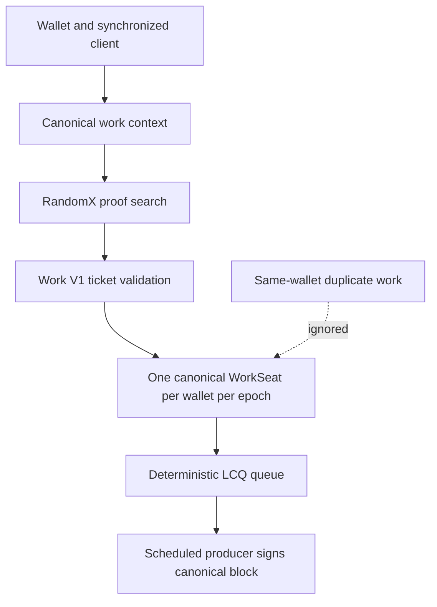
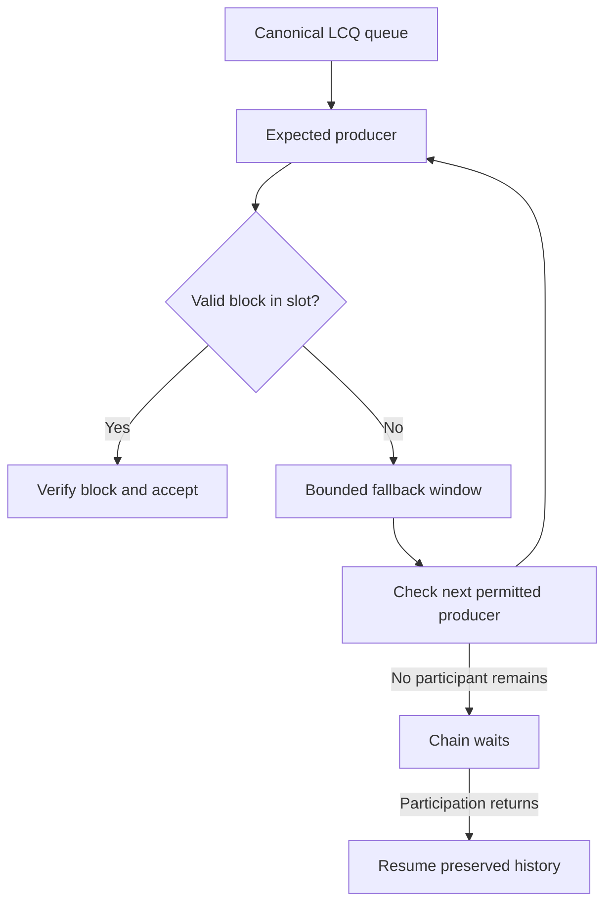
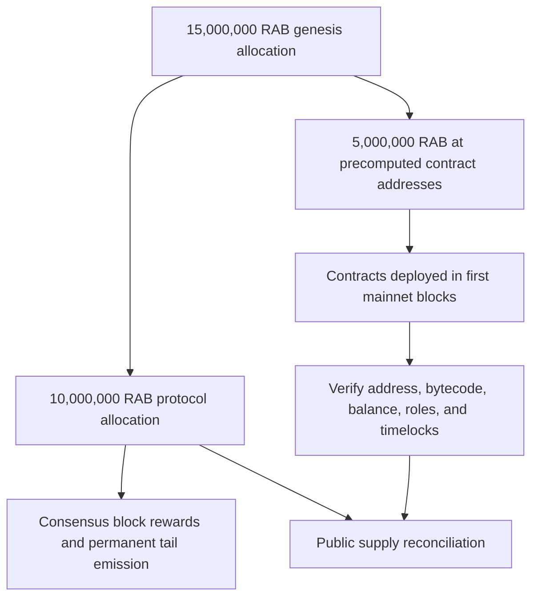

# Rabbit Chain

## A Permissionless EVM Layer 1 with Live Consensus Queue

**Technical Whitepaper - Pre-Testnet Edition v0.9-r4**
**30 August 2026**

> One eligible wallet. One fair chance.

---

## Document status

This document describes the intended architecture and the implementation state of Rabbit Chain before the public testnet. It is a technical disclosure, not an offer of securities, a promise of profit, or a guarantee of network performance. Where this paper and executable network rules differ, the versioned source code, genesis file, and canonical chain state are authoritative.

| Item | Status |
|---|---|
| Public testnet | Pre-launch; infrastructure not yet activated |
| Testnet chain ID | 9280 |
| Planned mainnet chain ID | 928 |
| Native asset | RAB |
| Execution | Ethereum Virtual Machine compatible |
| Consensus | LCQ — Live Consensus Queue |
| Work proof | RandomX-backed Work V1 |
| Canonical source branch | `testnet-release-v1` |
| Validated source commit | `e9875409dcf27e497812965296cece5d2e0f267a` |
| Evidence checkpoint | `b9967ca73cf5fe30b854d10ae55a48f2127efb2c` |

---

## Abstract

Rabbit Chain is a permissionless, EVM-compatible Layer 1 network designed around a simple fairness objective: multiplying mining processes must not multiply a wallet's opportunity to obtain a canonical production seat. The protocol combines computational work, an on-chain participant registry, deterministic ordering, liveness rules, and committee participation in a mechanism called **Live Consensus Queue (LCQ)**.

Traditional proof-of-work systems tend to assign block-production probability in proportion to accumulated hash power. Rabbit Chain instead uses work as an admission and liveness signal for a time-bounded **WorkSeat**. Eligible identities are then ordered deterministically for block production. A participant may run redundant software and hardware, but duplicate work associated with the same wallet must not create duplicate canonical seats in the same epoch.

The network retains the Ethereum execution model so existing wallets, Solidity contracts, developer tooling, transaction formats, and JSON-RPC conventions can be used with limited adaptation. Consensus, however, is Rabbit-specific. LCQ separates work discovery from scheduled production and distributes protocol rewards between the producer and a selected committee.

Pre-launch gates have exercised fresh multi-node operation, restart behavior, Work V1 transport, canonical ticket handling, and the one-wallet/one-seat invariant. In the final extraordinary live gate, three independent miner processes using the same wallet produced exactly one canonical WorkSeat, with zero duplicate seat, followed by a successful re-audit after node restart.

## 1. Motivation

Public blockchains promise open participation, yet access to meaningful block production often concentrates around capital, specialized hardware, pools, privileged validator sets, or operational scale. Permissionless entry alone does not guarantee equal opportunity after entry.

Rabbit Chain addresses a narrower and measurable problem: **process multiplication should not become identity multiplication**. If one participant opens three miner processes with the same wallet, the protocol should observe redundancy, not three independent claims to selection.

The design follows five principles:

1. **Permissionless entry.** No manual approval, private validator list, or administrator transaction should be required to begin participating.
2. **Wallet-bounded opportunity.** One eligible wallet receives at most one canonical WorkSeat per epoch.
3. **Deterministic verification.** Honest nodes given the same canonical history must derive the same registry, eligible set, and queue.
4. **Recoverable liveness.** Temporary inactivity, node failure, or loss of producers should not require a trusted operator to rewrite the chain.
5. **EVM utility.** Consensus innovation should coexist with established smart-contract tooling and account semantics.

These goals do not eliminate every form of concentration. A person may control multiple wallets, and no permissionless protocol can prove unique human identity without additional assumptions. LCQ therefore enforces a precise technical invariant — one seat per eligible wallet per epoch — and combines it with bond, activity, work, delay, and penalty rules that raise the cost of mass identity creation.

## 2. System overview

Rabbit Chain has four cooperating layers:

- **Execution layer:** EVM state transition, accounts, transactions, receipts, logs, gas, and smart contracts.
- **Consensus layer:** LCQ validation, registry snapshots, queue resolution, producer signatures, timeout/fallback handling, and committee selection.
- **Work layer:** RandomX-backed proof generation and peer-to-peer Work V1 ticket transport.
- **Network layer:** peer discovery, transaction and block propagation, consensus messages, RPC access, and independently operated infrastructure.

The intended user path is deliberately short:

> Download → run → use a wallet → mine.

Registration and activation are protocol-driven. The client resolves the local participant, submits valid work, observes activation rules, and joins the deterministic queue when eligible.

*Figure 1. Work qualifies a wallet for a bounded canonical seat; the LCQ queue, rather than a continuing hash race, schedules block production.*

### 2.1 Rabbit Chain at a glance

| Question | Short answer |
|---|---|
| What is Rabbit Chain? | A permissionless EVM Layer 1 with its own LCQ consensus |
| What is LCQ? | A mechanism that converts valid work into a wallet-bounded position in a deterministic live production queue |
| What makes it different? | Running more miner processes with the same wallet must not create more canonical seats for that wallet in the same epoch |
| Is it ordinary PoW? | No. RandomX work qualifies participation; the LCQ queue schedules block production |
| Is it PoS? | No. Bonding supports eligibility and anti-abuse rules, but stake weight alone does not select the next producer |
| Can anyone join? | Yes, subject to the same public protocol rules, work, bond, activation, activity, and client requirements |
| Can Ethereum tools be used? | The goal is compatibility with common EVM wallets, Solidity, transactions, contracts, logs, and JSON-RPC tooling |
| What is the native asset? | RAB, used for gas, rewards, bonding, and protocol accounting |
| Is the public testnet live? | Not at this edition's publication checkpoint |

### 2.2 LCQ compared with common models

| Property | Conventional PoW | Conventional PoS | Rabbit LCQ |
|---|---|---|---|
| Primary admission signal | Computational work | Locked stake | Valid work plus protocol eligibility |
| Typical selection weight | Hash power | Stake weight | One canonical queue seat per eligible wallet per epoch |
| Block producer | Hash-race winner | Stake-selected validator | Deterministically scheduled eligible wallet |
| Duplicate processes on one wallet | Usually add hash rate | Usually operational redundancy | May help find the first proof but must not add canonical seats |
| Capital still matters? | Hardware and energy matter | Stake matters directly | Compute, bond, uptime, and multiple funded wallets can still matter |
| Unique-human guarantee | No | No | No |

This comparison is conceptual. Individual PoW and PoS networks differ, and the Rabbit implementation is defined by its released source and configuration.

## 3. Live Consensus Queue

### 3.1 Core idea

LCQ converts valid computational work into a bounded right to participate in a deterministic production schedule. It is not conventional hash-race proof of work: the first valid hash does not automatically grant indefinite control over successive blocks. It is also not conventional proof of stake: capital weight alone does not determine the next producer.

The canonical chain maintains a participant registry. At each relevant height or epoch boundary, all honest nodes derive an eligible set from the same historical state. The set is ordered using canonical chain entropy, including the parent block context, and each eligible wallet occupies no more than one position.

Conceptually:

\[
E_h = \{p \in R_h : \operatorname{Eligible}(p,h)=\text{true}\}
\]

\[
Q_h = \operatorname{Order}(E_h,\ H_{h-1},\ e_h)
\]

where \(R_h\) is the registry snapshot, \(H_{h-1}\) is canonical parent context, \(e_h\) is the epoch, and \(Q_h\) is the deterministic queue. The executable client defines the exact encoding, hashing, and tie-breaking rules.

### 3.2 Participant eligibility

A participant is eligible only when all active protocol checks pass. The implemented checks include a non-zero address, an acceptable jail state, a sufficient bond according to network parameters, and a valid recent activity record. Bootstrap treatment at the first block is explicit so a new network can begin without relying on pre-existing heartbeats.

Eligibility is evaluated from historical canonical state, not from an unverified local preference. A node cannot make a wallet eligible merely by configuring it locally.

### 3.3 Activation delay

Newly observed participants do not receive immediate influence over the current queue. An activation delay separates canonical registration from eligibility. If a participant is registered at block `r` and the released network parameter is `ActivationDelay = d`, the earliest activation block is derived as `r + d`, subject to every other eligibility check still passing at that block. Registration therefore does not guarantee a seat or a block; after activation the wallet must still provide valid work, satisfy bond/activity/jail rules, obtain at most one canonical WorkSeat in the epoch, and wait for its deterministic queue position.

The pre-testnet paper does not invent `d`. The exact public-testnet value must be copied from the finalized genesis/configuration into the release guide and parameters manifest before block 1. A release is incomplete if users cannot determine `registration block`, `ActivationDelay`, and `earliest activation block` from public data.

### 3.4 WorkSeat lifecycle

A WorkSeat is associated with a participant wallet and epoch. Its lifecycle is:

1. The client obtains the canonical work context.
2. A miner computes RandomX proofs against that context.
3. A valid ticket is submitted over the Work V1 transport.
4. Nodes validate the proof, context, participant status, epoch, and duplication rules.
5. An accepted ticket becomes eligible for canonical inclusion.
6. Canonical history grants at most one seat to the participant for that epoch.
7. The queue uses the canonical eligible-seat set for production ordering.

Tickets that are stale, malformed, invalid, ineligible, or duplicate must not create additional seats.

### 3.5 One wallet, one seat

For participant \(p\) and epoch \(e\), the intended invariant is:

\[
\operatorname{CanonicalSeats}(p,e) \leq 1
\]

This invariant applies even when multiple processes, machines, or submissions use the same wallet. Redundant mining can improve availability or the chance that the wallet finds its first valid proof, but it cannot create multiple canonical queue identities for that wallet during the same epoch.

This is wallet fairness, not proof of unique-personhood. The distinction is essential: the protocol does not claim that one wallet always equals one human.

### 3.6 A complete miner example

Consider Alice, who controls wallet `A`:

1. Alice installs the official or reproducibly built Rabbit software and verifies its hash.
2. Her node connects to peers and independently synchronizes the canonical chain.
3. The client resolves wallet `A` as the local participant and observes the current registry, epoch, work context, bond, activity, and activation rules.
4. If `A` is new, its canonical registration block is recorded. The client displays or derives the earliest activation block from the released `ActivationDelay`; Alice waits while the chain advances and keeps every other eligibility condition valid.
5. Alice starts one miner process. It searches for a valid RandomX proof bound to the current challenge and dataset anchors.
6. After finding a proof, the client submits a Work V1 ticket. Nodes independently validate the proof and participant state.
7. Once the ticket is canonically recognized, wallet `A` may hold one WorkSeat for that epoch.
8. Every honest node derives the same queue from canonical history. When `A` reaches the permitted production position, Alice's client builds and signs a block.
9. Other nodes verify the expected producer, seal, transactions, EVM result, gas, rewards, and all LCQ rules before accepting it.
10. If Alice opens two additional miners with wallet `A`, they may search redundantly, but wallet `A` must still receive no more than one canonical seat in that epoch.
11. If Alice is offline during her turn, timeout and fallback rules allow the next permitted producer to advance liveness.

Alice never asks an administrator to approve her wallet. She also cannot make herself eligible merely by editing a local configuration: canonical nodes recompute every relevant rule.

## 4. Work V1 and RandomX

Rabbit Chain uses a RandomX-backed work path because RandomX is designed for general-purpose CPUs and uses randomized execution and memory-hard techniques to reduce the relative advantage of specialized hardware. Rabbit integrates this proof into LCQ ticket admission rather than adopting a conventional highest-hashpower-wins block race.

The work context binds a proof to canonical network state. It includes an epoch, a challenge anchor, a dataset anchor, and canonical runtime difficulty. A submitted proof is useful only for the context for which it was produced. Context binding helps prevent replay across epochs, networks, or unrelated chain histories.

Work V1 is carried by a dedicated peer-to-peer transport. Production activation is guarded by network identity and genesis markers so a laboratory transport configuration cannot silently activate on an unintended network.

The pre-launch validated difficulty was `100000` (`0x186a0`). This value is a network parameter, not a permanent promise; the public genesis and versioned client are authoritative.

## 5. Block production and liveness

### 5.1 Scheduled producer

For a given height, nodes independently derive the expected producer from the canonical queue and active rules. The producer constructs an EVM block, includes valid transactions, respects gas and fee rules, and signs the LCQ header material with the participant key.

### 5.2 Producer authentication

Rabbit headers carry LCQ-specific extra data and a producer seal. Nodes verify the seal against the expected participant and canonical header fields. A locally configured coinbase address is not sufficient authorization; the signature and queue-derived role must validate.

### 5.3 Timeout and fallback

If the scheduled producer does not publish a valid block within its slot, fallback rules advance liveness through subsequent allowed positions and bounded timing windows. Stale candidates are rejected against current canonical context. The objective is to preserve deterministic agreement while avoiding dependence on one online producer.

### 5.4 Network interruption and recovery

If participation falls to zero, the chain may stop rather than fabricate work or appoint a trusted emergency producer. When a valid participant returns, recovery rules derive from preserved canonical state and resume after the last accepted block. Nodes must not delete history or reset to genesis to restore liveness.

This recovery model has a trade-off: safety remains tied to verifiable history, but time to resume depends on valid work, participant eligibility, and propagation.

*Figure 2. A missed producer advances through public fallback rules. If no eligible participant remains, the chain waits and later resumes from preserved canonical history.*

## 6. Committee and rewards

Each canonical block divides the configured protocol reward between the producer and an eligible committee:

| Recipient | Share |
|---|---:|
| Block producer | 70% |
| Committee | 30% |

The committee is derived deterministically from canonical participant state and bounded by configured minimum and maximum sizes. Reference pre-launch parameters use a minimum of 32 and maximum of 128 committee members, with a committee ratio of 3000 basis points. Small bootstrap or laboratory networks may operate under explicit special-case parameters; the released genesis controls the public network.

Committee distribution is intended to spread rewards beyond the single scheduled producer and reward active consensus participation. When a valid committee is available, 70% goes to the block producer and 30% is divided among the committee under the client implementation's deterministic rounding rules. When no valid committee recipient exists, the producer receives 100% of that block's configured reward; no committee share is left unassigned.

Mining rewards produced by the active consensus are credited immediately and are spendable after the block becomes canonical. The legacy first-100,000-block mining lock is not active and must not be presented as part of the live monetary policy. The separate 100,000 RAB testnet participation reserve described in Section 8 is an allocation program, not a lock on protocol mining rewards.

### 6.1 Era and block-reward schedule

The active reward calculation uses an era length of **8,409,600 blocks**. Era boundaries are derived from the canonical block number. Because block 0 is genesis and carries no mining reward, the first paid interval contains blocks 1 through 8,409,599. At block 8,409,600 the second reward level begins.

| Reward period | Canonical blocks | Base reward per block | Policy |
|---|---:|---:|---|
| First reward period | 1-8,409,599 | 1.20 RAB | Initial block reward |
| Second reward period | 8,409,600-16,819,199 | 0.60 RAB | First halving |
| Third reward period | 16,819,200-25,228,799 | 0.30 RAB | Second halving |
| Tail-emission period | 25,228,800 onward | 0.15 RAB | Final reward floor; no further halving |

The 0.15 RAB reward continues permanently unless a future consensus change is adopted through a separately published network upgrade. Therefore Rabbit Chain has continuing tail emission and no finite maximum supply under the active schedule. For a block with a valid committee, the table gives the total base reward before the 70%/30% split. Without a valid committee, the producer receives the full amount.

## 7. RAB economic model

RAB is the native asset used for gas, protocol rewards, bonding, and network-level economic accounting. The genesis allocation is **15,000,000 RAB**. This is the complete block-0 allocation, not a maximum supply: consensus block rewards add new RAB according to Section 6.1, and the permanent 0.15 RAB tail reward means total supply is not finitely capped. The testnet participation reserve is part of the 15,000,000 RAB genesis allocation; it is not additional genesis allocation or a separate mint.

| Allocation | RAB | Share |
|---|---:|---:|
| Staking and protocol participation | 10,000,000 | 66.67% |
| Liquidity | 2,000,000 | 13.33% |
| Rabbit Club/community | 1,000,000 | 6.67% |
| Operational costs | 400,000 | 2.67% |
| Testnet participation rewards | 100,000 | 0.67% |
| Creator and developers | 1,500,000 | 10.00% |
| **Total genesis allocation** | **15,000,000** | **100.00%** |

Percentages are rounded to two decimal places. The integer RAB amounts, whose sum is exactly 15,000,000 RAB, are authoritative for genesis allocation only. They do not include later protocol issuance.

The earlier 500,000 RAB operational allocation is therefore divided internally as follows:

| Component of the former operational allocation | RAB | Rule |
|---|---:|---|
| General operational costs | 400,000 | Infrastructure, security, legal/compliance, audits, software, communications, and documented project operations |
| Public-testnet participation program | 100,000 | Reserved exclusively for eligible miners, builders, testers, and valid bug hunters under the published program rules |
| **Combined amount** | **500,000** | **No change to the 15,000,000 RAB genesis allocation and no separate mint for this program** |

**Genesis-allocation identity:** `15,000,000 RAB = 10,000,000 + 2,000,000 + 1,000,000 + 400,000 + 100,000 + 1,500,000 RAB`.

### 7.1 Genesis allocation and supply accounting

The mainnet design must make both components of supply independently verifiable: the 15,000,000 RAB genesis allocation and all later consensus issuance. No allocation table, website, multisig, vault, token interface, or off-chain statement may create balances outside the released genesis and consensus implementation.

Because RAB is the native asset of Rabbit Chain rather than an ordinary ERC-20 token, not every monetary rule belongs in one token contract. Transparency is divided between:

- **genesis and consensus rules**, which define initial native balances, issuance, rewards, locks, and supply behavior;
- **public vault/vesting contracts**, which hold allocations that require time-based or rule-based release;
- **public treasury contracts**, used where human-approved operational spending is unavoidable and governed by disclosed multisig/timelock rules;
- **versioned disclosures**, which connect every allocation to an address, balance, contract, rule, and responsible signing policy.

The absence of a single ERC-20 contract must never be confused with absence of on-chain verification. Native balances, consensus issuance, contract balances, releases, and transfers remain observable through a validating node and block explorer.

### 7.2 Allocation enforcement plan

Before mainnet block 1, the final genesis and release package must publish the enforcement method for every allocation. The genesis file creates the native balances, but it does **not** contain the deployed bytecode of the treasury, reward, liquidity, or vesting contracts. Those contracts are deployed by canonical transactions in the first mainnet blocks, as described in Section 7.3.

| Allocation | Amount | Required enforcement and disclosure |
|---|---:|---|
| Staking and protocol participation reserve | 10,000,000 RAB | Genesis reserve, separate from block-reward issuance. It must remain traceable at disclosed genesis address(es) or a publicly verifiable mechanism. Its custody, staking/participation eligibility, release destinations, authorization, and spending limits must be frozen before mainnet. It is not the source of the 1.20/0.60/0.30/0.15 RAB rewards and must never be counted again as consensus issuance. |
| Liquidity | 2,000,000 RAB | Dedicated on-chain vault or disclosed address; release conditions, authorized destinations, liquidity transactions, LP-token custody, and any lock disclosed |
| Rabbit Club/community | 1,000,000 RAB | Dedicated community treasury or distribution vault; purpose, authority, voting/approval process if any, and every transfer visible |
| Operational costs | 400,000 RAB | Dedicated operations treasury, separate from all other allocations; signer policy and categorized periodic reporting |
| Testnet participation rewards | 100,000 RAB | Dedicated reward vault; cannot be spent for operations, liquidity, creator compensation, or unrelated community programs |
| Creator and developers | 1,500,000 RAB | Public vesting vault enforcing the announced cliff and installment schedule |

Logical contract names in this paper are descriptions, not deployed addresses. Before mainnet, the registry must publish each precomputed contract address and all inputs needed to reproduce it. Deployment block numbers and transaction hashes can only be filled after the first mainnet blocks are canonical. No placeholder address may be presented as deployed or verified.

### 7.3 Deterministic deployment in the first mainnet blocks

Rabbit Chain will use a two-stage launch for contract-controlled allocations:

**Stage 1 — Genesis reserves the native RAB balances.** Each contract-controlled allocation is assigned to a precomputed, contract-creation address. At block 0 that address has the disclosed RAB balance but no contract code and no controlling externally owned account key.

**Stage 2 — The first canonical mainnet blocks deploy the contracts.** The exact audited creation transactions install the treasury, liquidity, reward, and vesting bytecode at the precomputed addresses. The balance already present at each address then becomes controlled by that contract's verified rules.

This is not a claim that contracts exist before mainnet. A precomputed address is only a deterministic destination. Until the expected bytecode is deployed and verified, its allocation must remain unusable.

The final deployment manifest must publish, for every contract:

- whether `CREATE` or `CREATE2` is used and the exact derivation formula;
- deployer or factory address, deployer nonce or salt, initialization-code hash, compiler version, optimizer settings, libraries, and constructor arguments;
- predicted contract address and its exact genesis RAB balance;
- creation bytecode and expected runtime-bytecode hash;
- deployment order and the permitted first-block deployment window;
- owner, administrator, multisig signers, threshold, timelock, upgrade, pause, and recovery powers;
- deployment transaction, canonical block, resulting runtime-bytecode hash, events, and post-deployment balance.

The procedure must be rehearsed from a fresh candidate genesis before launch. For each deployment, independent checks must prove `predicted address = deployed address`, `expected runtime hash = observed runtime hash`, and `genesis balance = post-deployment balance` before any release, transfer, liquidity action, reward claim, or treasury spending is permitted. A wrong address, wrong bytecode, wrong owner, wrong balance, missing transaction, or deployment outside the published window fails the mainnet launch gate. The affected reserve remains unavailable; it must not be redirected to an undisclosed replacement address.

The planned sequence is:

| Stage | Canonical action | Public evidence |
|---|---|---|
| Block 0 | Create the 10,000,000 RAB staking/participation reserve and fund the five precomputed contract addresses totaling 5,000,000 RAB | Genesis file, disclosed reserve address/mechanism, hashes, balance proofs, address-derivation manifest |
| First mainnet blocks | Deploy the exact liquidity, community, operations, testnet-reward, and creator/developer contracts | Transactions, receipts, creation and runtime bytecode, verified source |
| Verification gate | Compare predicted and actual addresses, code hashes, balances, roles, limits, and timelocks | Reproducible verification report and contract registry |
| Activation | Permit each contract's intended use only after its verification passes | Public status, activation transaction if applicable, explorer links |

Exact deployment block numbers are not invented in this pre-testnet edition. They will be frozen in the signed mainnet deployment manifest after the full testnet rehearsal and before mainnet genesis is released.

### 7.4 Creator and developer vesting

The creator/developer allocation is planned to remain locked until six months after official mainnet liquidity begins. Ten percent of that allocation is then scheduled for release, with the remaining ninety percent released over 24 subsequent installments. This is a policy commitment to be encoded or enforced through publicly auditable mechanisms before mainnet.

Applied to 1,500,000 RAB, the intended schedule is:

| Stage | Amount | Cumulative released |
|---|---:|---:|
| Initial release after the six-month cliff | 150,000 RAB | 150,000 RAB |
| Remaining locked balance | 1,350,000 RAB | — |
| Each of 24 subsequent equal installments | 56,250 RAB | Up to 1,500,000 RAB after installment 24 |

The final contract must define the installment interval, liquidity-start reference, timestamp/block semantics, beneficiary addresses, rounding behavior, revocability, transferability, and treatment of compromised keys. Until those fields are frozen in verified code, this schedule is an economic commitment but not yet a deployed enforcement claim.

### 7.5 Transparency standard for contracts and treasuries

Every contract or address holding an allocated RAB reserve must have a public registry entry containing:

- allocation name and exact RAB amount;
- network and chain ID;
- precomputed address, address-derivation inputs, genesis funding proof, deployment address, block, and transaction;
- deployment and funding transaction hashes;
- verified source code and exact Git commit;
- compiler version, optimization settings, constructor arguments, and linked libraries;
- creation-bytecode and runtime-bytecode hashes;
- owner, administrator, guardian, pauser, upgrader, and beneficiary powers;
- multisig signers by public address, signing threshold, and replacement procedure;
- timelock duration and every function exempt from the timelock;
- whether the contract is immutable, upgradeable, pausable, revocable, or recoverable;
- implementation and proxy addresses for any upgradeable design;
- release schedule and machine-readable next-unlock state;
- current balance, released amount, remaining amount, and destination history;
- security review status and known limitations.

Where discretion is unavoidable, Rabbit Chain should use separated allocation addresses, a multisig threshold greater than one signer, and an on-chain timelock appropriate to the action. The existence of a multisig does not by itself make a treasury decentralized; signer concentration and legal/operational relationships must also be disclosed.

No private agreement may override the public rules. Emergency, pause, upgrade, recovery, sweep, recipient-change, arbitrary-call, self-destruct, or token-rescue permissions must be documented prominently rather than hidden in source code.

### 7.6 Reporting and reconciliation

At launch and at regular intervals, Rabbit Chain should publish an allocation reconciliation that third parties can reproduce:

**Network reconciliation:** `genesis allocations + protocol issuance - burned RAB = observable supply`.

For each reserved allocation:

**Allocation reconciliation:** `initial reserve = current balance + released amount + documented burn, if any`.

Reports must link to raw addresses and transactions rather than rely only on screenshots or manually entered totals. Corrections must remain in public version history; an incorrect prior report should not be silently replaced.

*Figure 3. Genesis allocates 15,000,000 RAB and funds deterministic future contract addresses. Consensus rewards then increase total supply under the published era schedule.*

The table is a genesis-allocation disclosure, not a maximum-supply claim or forecast of market value. Total issued supply at any block equals genesis allocation plus protocol rewards minus any provable burns. Circulating supply may be lower because of locks, vesting, treasury reserves, and provably inaccessible balances.

## 8. Testnet participation program

The public testnet is intended to validate real activity from blocks 1 through 100,000. A planned **100,000 RAB mainnet reward pool** is reserved from the 15,000,000 RAB genesis allocation described in Section 7. It does not add to that genesis allocation and cannot also be counted as operational spending. This program is separate from protocol block rewards and their era schedule.

| Category | Planned pool |
|---|---:|
| Miners | 50,000 RAB |
| Builders | 30,000 RAB |
| Testers | 15,000 RAB |
| Valid bug hunters | 5,000 RAB |
| **Total reserved** | **100,000 RAB** |

Eligibility is based on verifiable testnet activity, such as mining, transactions, deployments, use, and accepted bug reports. Likes, follows, reposts, or other social engagement do not determine rewards. Full criteria, wallet-verification procedures, exclusions, anti-abuse rules, and dispute handling must be published before block 1.

Planned distribution occurs six months after official mainnet liquidity begins, subject to the final published program rules and legal review. Testnet assets themselves have no promised monetary value.

### 8.1 Reward-vault transparency

Before mainnet distribution, the 100,000 RAB must be held in a dedicated public reward vault or equivalently restrictive on-chain mechanism. Its balance must not be commingled with the 400,000 RAB operations treasury.

The recommended claim design is a verified, fixed-cap distribution contract whose total successful claims can never exceed 100,000 RAB. If a Merkle-root claim system is used, Rabbit Chain must publish the complete underlying allocation file so anyone can reconstruct the root and verify their proof. Publishing only a root is not sufficient transparency.

Before testnet block 1, separate program rules must freeze or explicitly define:

- the exact eligibility window: blocks 1 through 100,000, inclusive;
- recognized activity for each category and its measurement method;
- whether one wallet may qualify in multiple categories;
- per-wallet minimums, maximums, ties, rounding, and anti-Sybil treatment;
- prohibited behavior, exclusions, sanctions, and evidence standards;
- bug severity definitions, duplicate-report priority, and disclosure rules;
- preliminary-results publication, challenge procedure, and decision authority;
- final allocation dataset format and cryptographic hash;
- the objective on-chain event or timestamp that starts the six-month delay;
- claim opening, claim deadline, unclaimed-RAB destination, and recovery rules;
- tax, sanctions, jurisdiction, identity, and legal restrictions if applicable.

No social engagement metric may be introduced later as a hidden eligibility factor. Any rule amendment after block 1 must be versioned, dated, justified, and assessed for its effect on participants who acted under the earlier rules.

### 8.2 Public distribution dataset

The final distribution publication must contain at least:

| Field | Purpose |
|---|---|
| Eligible wallet | Identifies the on-chain recipient |
| Category | Miner, builder, tester, or valid bug hunter |
| Measured contribution | Reproducible basis for eligibility |
| Assigned RAB | Exact mainnet amount |
| Calculation version | Links the row to the published methodology |
| Evidence references | Testnet blocks, transactions, deployments, reports, or accepted issues |
| Claim status | Unclaimed, claimed, rejected, expired, or otherwise resolved |

Personal information should not be published merely for transparency. The public dataset should expose what is necessary to verify allocation correctness while avoiding unnecessary identity data.

## 9. EVM execution and fees

Rabbit Chain preserves the account-based Ethereum execution model and EVM semantics supplied by its versioned go-ethereum foundation. This enables Solidity smart contracts, familiar address formats, signed transactions, logs, receipts, ABI tooling, and standard wallet integration.

The network is designed to support EIP-1559-style dynamic fee transactions and base-fee accounting. Users specify fee limits and priority fees; the protocol calculates block base fees according to canonical gas usage rules. Compatibility claims always apply to the specific Rabbit release and activated fork schedule, not automatically to every future Ethereum change.

Consensus compatibility and EVM compatibility are different claims. Rabbit does not use Ethereum's present consensus protocol, validator set, finality gadget, network ID, or native asset.

## 10. Networking and infrastructure

Rabbit Chain uses peer-to-peer block, transaction, and consensus propagation. Official infrastructure is intended to provide an initial access path, not an exclusive gateway.

The public-testnet launch plan includes:

- two independently hosted discovery/boot entry points;
- one public HTTP/WebSocket RPC service;
- one block explorer and indexer;
- DNS, TLS, rate limiting, firewalling, monitoring, and backup procedures;
- public instructions for community-operated nodes, RPC endpoints, and explorers.

Bootnodes help peers find one another but do not grant consensus authority. An RPC endpoint exposes node functions but does not define canonical truth. An explorer indexes chain data but is not the chain. Users should be able to verify data using their own node.

Official launch infrastructure must use fresh datadirs, chaindata, node keys, databases, and runtime secrets. Laboratory state is never promoted into the public network. Only audited source, validated binaries, deliberately finalized genesis/configuration, and reproducible deployment procedures may be reused.

### 10.1 Official domains and stable endpoint plan

The following names are reserved as the stable official interface. A reserved endpoint is not evidence that a service is already live. Before activation, the website and repository must mark it **inactive**; after activation, DNS, TLS, service identity, chain ID, genesis hash, and health checks must all agree.

| Purpose | Testnet | Mainnet | Pre-launch status |
|---|---|---|---|
| Website | `https://rabbitchain.org/` | `https://rabbitchain.org/` | Active project website |
| Documentation | `https://docs.rabbitchain.org/` | `https://docs.rabbitchain.org/` | Reserved until documentation deployment |
| HTTP RPC | `https://rpc-testnet.rabbitchain.org/` | `https://rpc.rabbitchain.org/` | Reserved; must not be presented as active before health verification |
| WebSocket RPC | `wss://rpc-testnet.rabbitchain.org/ws` | `wss://rpc.rabbitchain.org/ws` | Reserved; must not be presented as active before health verification |
| Explorer | `https://explorer-testnet.rabbitchain.org/` | `https://explorer.rabbitchain.org/` | Reserved until indexer verification |
| Faucet | `https://faucet-testnet.rabbitchain.org/` | Not applicable | Reserved; testnet assets only |
| Network status | `https://status.rabbitchain.org/` | `https://status.rabbitchain.org/` | Reserved until monitoring deployment |
| Downloads | `https://rabbitchain.org/downloads` | `https://rabbitchain.org/downloads` | Planned permanent release page |
| Source organization | `https://github.com/rabbitmainnet` | `https://github.com/rabbitmainnet` | Active official organization |

The mainnet faucet cell is intentionally “Not applicable”: the project will not promise free mainnet RAB through a faucet. Community-operated endpoints may use other domains, but they must not be represented as official Rabbit Chain infrastructure.

### 10.2 Launch identity file

For machine-readable verification, each public network should publish a versioned `network-manifest.json` from the website and repository containing:

- network name, chain ID, native symbol, and genesis hash;
- canonical genesis/configuration download URL and SHA-256;
- release tag, source commit, binary names, platforms, and SHA-256 hashes;
- official bootnode records;
- HTTP RPC, WebSocket RPC, explorer, faucet where applicable, status, and documentation URLs;
- activation block/epoch for every consensus-relevant feature;
- contract registry URL and hash;
- creation timestamp, manifest version, and signature or equivalent authenticity proof.

Wallet setup pages, explorer metadata, releases, and third-party listings should be generated from or checked against this manifest to reduce copy-and-paste inconsistencies.

## 11. Security model

### 11.1 Protected properties

Rabbit's validation rules are designed to protect:

- deterministic agreement on the eligible set and queue;
- a maximum of one canonical seat per wallet per epoch;
- rejection of invalid, stale, replayed, or duplicate work;
- authentication of the expected producer;
- deterministic reward calculation;
- persistence of canonical state across restart;
- separation between laboratory and production activation contexts.

### 11.2 Sybil resistance and limitations

Wallet deduplication prevents process-level multiplication behind the same address. Bonding, work cost, activation delay, recent activity, and jailing increase the cost of operating many addresses. They do not make Sybil attacks impossible and do not prove civil identity.

An attacker with many funded, active wallets and sufficient compute may obtain many eligible seats. Security therefore depends on economic parameters, distribution of participants, client correctness, peer connectivity, key safety, and honest validation by independent nodes.

### 11.3 Key and operational risks

Participants are responsible for wallet and node-key security. Compromise can enable unauthorized signing, reward theft, or network impersonation. RPC operators must disable dangerous administrative namespaces, protect signing interfaces, rate-limit public methods, and separate public traffic from authenticated engine or management interfaces.

### 11.4 Smart-contract and bridge risks

EVM compatibility permits arbitrary contracts, including unsafe or malicious ones. The base protocol does not audit user contracts. Bridges and wrapped assets introduce separate custody, oracle, validator, liquidity, and upgrade risks. Users must distinguish native RAB from third-party tokens and representations.

### 11.5 Experimental status

Before mainnet, Rabbit Chain remains experimental software. Testnet results reduce uncertainty but do not prove absence of vulnerabilities. Independent source review, reproducible builds, adversarial testing, incident procedures, and an appropriately scoped bug-bounty process remain necessary.

## 12. Validation evidence

Rabbit's pre-server gate tested the production code path before public infrastructure was created. The extraordinary live-seat test resumed a preserved three-node chain, established full peer connectivity, launched three real RandomX miner processes using the same wallet, and waited for canonical inclusion.

Observed result:

| Evidence | Result |
|---|---|
| Real miner processes | 3 |
| Unique mining wallets | 1 |
| Canonical WorkSeats for the wallet | 1 per epoch |
| Duplicate wallet seat | 0 |
| Canonical ticket | Block 504, epoch 3 |
| Re-audit after node restart | PASS |
| Genesis changed during gate | No |
| Source changed during gate | No |
| Public servers/mining started | No |

Evidence file:

`docs/audits/rabbit-testnet-extraordinary-live-seat-e9875409d.txt`

SHA-256:

`6bb8cf1e20e5428ec9206cc0a552071cf16463818ba2b25e09efa6d748534b64`

The report was committed to the official `testnet-release-v1` branch at documentation checkpoint `b9967ca73cf5fe30b854d10ae55a48f2127efb2c`. Later documentation commits do not change the validated source commit used by the tested binaries.

This evidence supports the tested invariant under the tested conditions. It is not a mathematical proof of all possible executions and should not be presented as an independent security audit.

## 13. Governance and upgrades

Rabbit Chain's consensus should not depend on an administrator contract or an undisclosed privileged key. Protocol evolution occurs through public source changes, reviewable releases, explicit activation rules, and community adoption of compatible clients.

During the pre-testnet phase, the founding development team coordinates releases and infrastructure. This practical coordination is disclosed as a centralization risk. The long-term objective is to reduce dependency on official infrastructure by enabling independent nodes, miners, RPC operators, explorers, developers, and reviewers.

Any consensus upgrade should publish:

1. motivation and security analysis;
2. exact source diff and release commit;
3. activation network and block/epoch;
4. backward-compatibility and rollback implications;
5. reproducible binaries and hashes;
6. test evidence and migration instructions.

## 14. Roadmap and launch gates

The roadmap is gate-driven rather than date-driven.

### Completed before infrastructure

- production Work V1 activation gates;
- fresh multi-node consensus and restart exercises;
- reward and canonical-state checks;
- live same-wallet multi-process seat deduplication;
- evidence committed to the official repository.

### Required before public testnet block 1

- freeze and publish testnet genesis and chain configuration;
- reproducibly build and hash Windows, Linux, and macOS packages;
- deploy fresh bootnodes, RPC/archive node, and explorer/indexer;
- configure DNS, TLS, firewalls, rate limits, monitoring, and backups;
- publish miner, node, developer, and wallet instructions;
- publish testnet reward-program terms and risk disclosure;
- complete a public-infrastructure dry run without opening mining;
- announce an exact, verifiable start procedure.

### Required before mainnet

- incorporate public-testnet findings;
- complete independent security review appropriate to the final scope;
- verify the published issuance, era, tail-emission, immediate-reward, vesting, and fee policies against the final client and genesis;
- finalize mainnet genesis with public hashes and review window;
- publish and rehearse the deterministic contract-address and first-block deployment manifest;
- deploy every allocation contract in the published first-block window and verify its address, runtime bytecode, balance, roles, and restrictions before activation;
- prepare incident-response and responsible-disclosure processes;
- launch entirely fresh mainnet infrastructure and state.

### Mainnet publication substitution checklist

This pre-testnet edition deliberately fixes the document structure before final mainnet values exist. The mainnet publication process must replace every field below and must fail if any placeholder remains:

| Field to finalize | Required evidence |
|---|---|
| Mainnet genesis hash | Published genesis file, SHA-256, and canonical block-0 hash |
| Final source/release commit | Signed tag, source archive, reproducible build record, and binary hashes |
| Bootnodes | Complete enode/ENR records, regions, operators, and connectivity test |
| RPC/explorer/status services | DNS, TLS certificate, health check, chain ID, genesis identity, and operator disclosure |
| Allocation contracts | Precomputed address and derivation inputs before launch; genesis funding proof; then deployment block/transaction, runtime hash, roles, exact balance, and verification status |
| Contract addresses | Deployment transaction, verified source, bytecode hash, constructor arguments, and security review |
| Multisigs and timelocks | Signer addresses, threshold, relationships, delay, guarded functions, and replacement policy |
| Vesting start reference | Objective liquidity activation transaction/event and resulting timestamp/block |
| Testnet reward root | Full public allocation dataset, hash, reproducible root script, contract root, and claim proofs |
| Legal and risk disclosures | Version, effective date, jurisdictional limitations, and immutable publication hash |

The final release must run an automated placeholder scan for strings such as `TBD`, `TODO`, `PLACEHOLDER`, `{ADDRESS}`, zero addresses used as unknown values, example domains, and unresolved template variables. Passing that scan does not prove correctness, so human and on-chain verification remain required.

## 15. Reproducibility and verification

A professional release must allow third parties to connect documents to executable artifacts. Each release should publish:

- Git commit and signed tag;
- genesis and configuration hashes;
- source archive hash;
- binary hashes by operating system and architecture;
- compiler, toolchain, build flags, dependencies, and build script;
- audit/gate evidence hashes;
- network identifiers, bootnode records, and official domains.

Users should verify downloaded binaries against published hashes and obtain hashes through more than one official channel where possible.

## 16. Parameters snapshot

The following values describe the current pre-launch reference configuration. The finalized public-testnet genesis supersedes this table.

| Parameter | Reference value |
|---|---:|
| Testnet chain ID | 9280 |
| Planned mainnet chain ID | 928 |
| Target block time | 10,000 ms |
| Fallback slots | 5 |
| Fallback window | 3,000 ms |
| Epoch length | 128 blocks |
| Activity window | 128 blocks |
| Committee minimum | 32 |
| Committee maximum | 128 |
| Committee reward ratio | 3,000 bps |
| Producer reward ratio | 7,000 bps |
| Reward era length | 8,409,600 blocks |
| Reward schedule | 1.20 -> 0.60 -> 0.30 -> 0.15 RAB |
| Tail emission | 0.15 RAB per block permanently |
| Mining-reward availability | Immediate after canonical credit |
| Work proof | RandomX / Work V1 |
| Reference proof difficulty | 100,000 |
| Producer seal length | 65 bytes |

## 17. How to participate

Rabbit Chain is intended to support several independent roles. One person may perform more than one role, but each role has different responsibilities.

| Role | What the participant does | What is required |
|---|---|---|
| User | Holds RAB, sends transactions, uses applications | EVM wallet, correct network configuration, RAB for gas |
| Miner/participant | Produces valid work and may receive an LCQ queue seat | Rabbit client, participant wallet, CPU resources, bond/activity required by the released rules |
| Node operator | Verifies and propagates blocks and transactions | Rabbit node, storage, bandwidth, uptime, secure configuration |
| RPC operator | Gives wallets and applications remote node access | Hardened node, HTTPS/WSS, rate limits, monitoring, restricted administrative APIs |
| Explorer operator | Indexes and presents public chain data | Indexer, database, archive-capable data source, web service |
| Builder | Deploys contracts, applications, tooling, or integrations | Solidity/EVM knowledge, test RAB, RPC access, development tools |
| Tester | Exercises wallets, transactions, contracts, mining, recovery, and UX | Test plan, reproducible reports, transaction hashes and logs |
| Reviewer | Reviews source, builds, cryptography integration, economics, or documentation | Relevant expertise and precise, reproducible findings |

Before the public testnet begins, users should rely only on links published through Rabbit Chain's official website and repository. They should verify the chain ID, genesis hash, software hash, RPC endpoint, explorer domain, and release commit. No one should share a seed phrase or private key with a website, administrator, support agent, miner, faucet, or RPC operator.

### 17.1 First-day user flow

1. Open the official release page from `rabbitchain.org` or the verified GitHub organization.
2. Download the package for the correct operating system and verify its SHA-256 hash.
3. Create a new testnet-only wallet or import a deliberately selected test wallet; never expose its private key.
4. Add Rabbit Testnet using the published chain ID `9280`, official RPC, currency symbol, and explorer URL.
5. Obtain valueless testnet RAB from the official faucet when available.
6. Send a small transaction and confirm it independently in the wallet, RPC, and explorer.
7. Builders may deploy a test contract; miners may follow the published node and mining guide.
8. Save transaction hashes, block numbers, logs, software version, and steps when reporting a problem.

The exact commands, ports, RPC URL, explorer URL, bootnodes, faucet URL, genesis hash, and release hashes are intentionally not frozen in this pre-launch whitepaper. They belong in versioned launch documentation because publishing placeholders as final values would create user risk.

## 18. Frequently asked questions

### Is Rabbit Chain already public?

Not at the v0.9 checkpoint. Consensus gates were completed locally before public servers or public mining were activated.

### Does one wallet always receive a block?

No. One wallet/one seat is an upper bound on canonical seats per epoch, not a guaranteed seat, block, reward, or income. The wallet must satisfy all protocol rules and valid work still has probabilistic cost.

### Can I run more than one miner?

Yes, for redundancy or to search for the wallet's first valid proof. Multiple processes using the same wallet must not create multiple canonical seats for that wallet in one epoch.

### Can one person create many wallets?

Yes. LCQ does not prove human identity. Work, bond, activation delay, activity, and penalty rules are intended to make mass participation costly and observable, but they cannot eliminate every Sybil strategy.

### Is expensive mining hardware required?

RandomX is designed for general-purpose CPUs, but performance still varies by processor, memory, configuration, energy cost, software, and network difficulty. The project does not promise equal hardware performance or profit.

### Is Rabbit Chain an Ethereum network?

Rabbit is an independent network with its own consensus, chain IDs, native asset, genesis, peers, and canonical history. EVM compatibility means it reuses the Ethereum execution environment and common tooling; it does not mean Ethereum secures Rabbit.

### Who controls the queue?

No RPC, explorer, bootnode, website, or administrator should assign queue positions. Each validating node derives the queue from canonical protocol state.

### What happens if the official RPC or explorer stops?

The chain can continue when independent peers and producers remain active. Users may run their own node, and community operators may provide alternative RPCs and explorers. Official services are access infrastructure, not consensus authorities.

### What happens when no miner is online?

Block production may stop. When valid participation returns, recovery proceeds from preserved canonical history under the active rules; the chain is not supposed to erase history or appoint a secret emergency producer.

### Are testnet tokens valuable?

Testnet assets have no promised monetary value. Any separate participation reward program follows its own published eligibility, verification, timing, legal, and anti-abuse rules.

### Where are final parameters found?

In this order of authority: canonical chain state, released genesis/configuration, versioned source code, signed release artifacts, and then explanatory documentation such as this whitepaper.

## 19. Glossary

| Term | Meaning in Rabbit Chain |
|---|---|
| Activation delay | Waiting period between participant recognition and eligibility for queue influence |
| Bond | Protocol-defined economic requirement associated with participant eligibility |
| Bootnode | Peer-discovery entry point; it does not control consensus |
| Canonical chain | The history accepted under the active consensus rules |
| Committee | Deterministically selected eligible participants sharing the configured committee reward |
| EVM | Ethereum Virtual Machine execution environment used for accounts and smart contracts |
| Epoch | Fixed block interval used to organize work, eligibility, or seat accounting |
| Fallback | Rule that permits another eligible producer after a scheduled producer misses its allowed window |
| Genesis | The network's initial block and configuration; its hash identifies the chain history |
| Jailing | Temporary protocol state that makes a sanctioned participant ineligible |
| LCQ | Live Consensus Queue, Rabbit's consensus and production-order mechanism |
| Participant | Wallet-addressed entity tracked by the canonical LCQ registry |
| Producer | Eligible participant scheduled to construct and sign a particular block |
| RandomX | CPU-oriented proof-of-work algorithm used by Rabbit's Work V1 path |
| Registry | Canonical participant state used to determine eligibility |
| RPC | Remote interface used by wallets and applications to query or submit data to a node |
| Seat/WorkSeat | Wallet-bounded, epoch-scoped canonical participation position obtained through valid work and eligibility |
| Sybil attack | Attempt to gain influence by operating many apparent identities |
| Ticket | Work V1 proof submission bound to a canonical work context |
| Work context | Epoch, challenge, dataset, difficulty, and related canonical data against which a proof is produced |

## 20. Conclusion

Rabbit Chain proposes a specific change to permissionless block production: computational effort admits an eligible wallet into a deterministic live queue, while canonical state prevents that wallet from multiplying seats by multiplying processes. LCQ combines this wallet-bounded opportunity with EVM execution, RandomX work, deterministic producer authentication, committee rewards, fallback rules, and recoverable canonical state.

The project should be judged by reproducible code and observable network behavior, not slogans. The next milestone is not a claim of completion; it is a fresh public-testnet deployment whose genesis, binaries, infrastructure, rules, and evidence can be independently inspected from block 1.

---

## References

1. Rabbit Chain source repository: <https://github.com/rabbitmainnet/rabbit-geth>
2. Rabbit Chain website: <https://rabbitchain.org/>
3. Rabbit Chain community: <https://discord.gg/TBWspuEZss>
4. RandomX source and documentation: <https://github.com/tevador/RandomX>
5. Ethereum Yellow Paper: <https://ethereum.github.io/yellowpaper/paper.pdf>
6. EIP-1559 specification: <https://eips.ethereum.org/EIPS/eip-1559>

## Version history

| Version | Date | Description |
|---|---|---|
| 0.9-r4 | 30 August 2026 | Repository-wide consistency correction: regenerated allocation PNG, synchronized machine-readable version, separated the 10,000,000 RAB genesis reserve from consensus issuance, and clarified activation-delay observability |
| 0.9-r3 | 30 August 2026 | Monetary-policy reconciliation: 15,000,000 RAB genesis allocation, active era schedule, permanent 0.15 RAB tail emission, immediate mining rewards, and committee zero-recipient behavior |
| 0.9 | 29 August 2026 | Pre-testnet technical edition; LCQ architecture, 15,000,000 RAB genesis allocation, 100,000 RAB testnet reserve sourced from the former operations allocation, contract/treasury transparency framework, validation evidence, risks, launch gates, participation guide, FAQ, and glossary |

## Contact and official channels

- Website: <https://rabbitchain.org/>
- GitHub: <https://github.com/rabbitmainnet>
- X: <https://x.com/rabbit_mainnet>
- Discord: <https://discord.gg/TBWspuEZss>

© 2026 Rabbit Chain contributors. Distribution permitted with attribution. Protocol behavior remains governed by the applicable open-source license and versioned source code.
